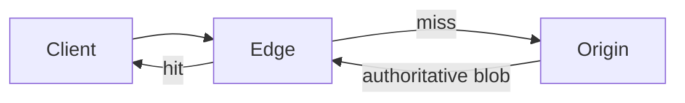

# cache-2

Edge-oriented package delivery demo in Rust: an **origin** that holds authoritative blobs, **edge** nodes that cache them with TTL and backfill on miss, and a small **regional routing directory** (GeoDNS-style hints) for picking preferred edge URLs.

## What you get

- **Origin server** – In-memory store, HTTP `GET` / `PUT` for packages, `ETag` + `Cache-Control` for cache-friendly responses.
- **Edge server** – Bounded in-memory cache (Moka); on cache miss, fetches from the origin and stores the result. Adds `X-Cache: HIT` or `MISS`.
- **Library** – `OriginStore`, `EdgePackageCache`, `EdgeDirectory`, `Region`, and related types for reuse or tests.
- **`resolve` command** – Prints a demo ordered list of edge base URLs for a region (JSON).

## Requirements

- Rust toolchain with **edition 2024** support (for example **Rust 1.85+**; CI/local should match `rustc` used to develop the crate).

## Build

```bash
cargo build --release
```

## Quick start

Run an origin and an edge in two terminals, then read a package through the edge.

**Terminal 1 – origin**

```bash
cargo run --release -- origin --listen 127.0.0.1:8080
```

On startup the origin seeds a package named `hello` so you can try the edge immediately.

**Terminal 2 – edge**

```bash
cargo run --release -- edge --listen 127.0.0.1:8081 --origin http://127.0.0.1:8080
```

**Upload a package (PUT on origin)**

```bash
curl -X PUT --data-binary @./my-artifact.bin http://127.0.0.1:8080/packages/my-artifact.bin
```

Keys must be non-empty and must not contain `/` (single path segment).

**Fetch through the edge**

```bash
curl -i http://127.0.0.1:8081/packages/my-artifact.bin
```

The first request is typically `X-Cache: MISS`; repeats within the TTL are `X-Cache: HIT`.

**Demo regional resolution (JSON)**

```bash
cargo run --release -- resolve europe
# americas | europe | asia-pacific | global
```

## CLI reference

| Command | Purpose |
|--------|---------|
| `origin` | Start the authoritative HTTP server. |
| `edge` | Start an edge cache that pulls from `--origin`. |
| `resolve` | Print demo edge URLs for a region. |

### `origin`

| Flag | Default | Description |
|------|---------|-------------|
| `--listen` | `127.0.0.1:8080` | Socket address to bind. |

### `edge`

| Flag | Default | Description |
|------|---------|-------------|
| `--listen` | `127.0.0.1:8081` | Socket address to bind. |
| `--origin` | *(required)* | Base URL of the origin (for example `http://127.0.0.1:8080`). |
| `--default-ttl-secs` | `300` | Time-to-live for cached entries at this edge. |
| `--max-entries` | `10000` | Maximum number of distinct keys in the edge cache. |

### `resolve`

Positional region (Clap value enum): `americas`, `europe`, `asia-pacific`, `global`.

## HTTP API

### Origin

| Method | Path | Description |
|--------|------|-------------|
| `GET` | `/health` | `200 OK` if the process is up. |
| `GET` | `/packages/{key}` | Returns the blob (`application/octet-stream`), `404` if missing. |
| `PUT` | `/packages/{key}` | Stores the request body as the package; `204` on success, `400` for invalid keys. |

### Edge

| Method | Path | Description |
|--------|------|-------------|
| `GET` | `/health` | `200 OK` if the process is up. |
| `GET` | `/packages/{key}` | Serves from cache or fetches from origin; `404` if the origin has no such key. |

## Logging

Logging uses `tracing`. Override filters with `RUST_LOG`, for example:

```bash
RUST_LOG=debug cargo run --release -- edge --origin http://127.0.0.1:8080
```

Default filter if unset: `cache_2=info,tower_http=info`.

## Library crate

The package exposes a library named `cache_2` (Rust’s normalization of `cache-2`). Example:

```rust
use cache_2::{EdgeDirectory, EdgePackageCache, Region};
use std::time::Duration;
use url::Url;

let dir = EdgeDirectory::demo();
let _edges = dir.resolve(Region::Europe);

let cache = EdgePackageCache::new(
    Url::parse("http://127.0.0.1:8080").unwrap(),
    10_000,
    Duration::from_secs(300),
);
// tokio runtime: cache.get_or_fetch("my-key").await
```

## Architecture (high level)



Production deployments would add TLS, object storage or a registry at the origin, purge APIs, health-checked routing, and singleflight on the edge to avoid stampedes on popular keys.

## Tests

```bash
cargo test
```

## License

This project does not include a license file yet; add one if you plan to distribute or accept contributions.
